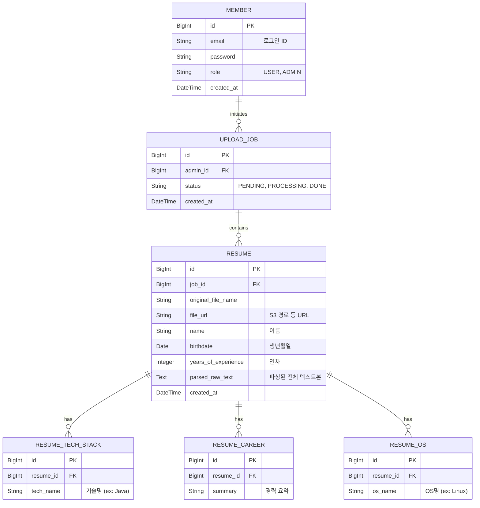

# 데이터베이스 설계서 및 스키마

## 1. 개요
확장성과 빠른 조회를 도모하기 위해 관계형 모델을 기본으로 설계하되, AI가 추출한 비정형/배열 데이터는 JSON 데이터 타입 및 별도 테이블로 정규화하여 관리합니다.

## 2. ERD (Entity Relationship Diagram)

## 3. 데이터베이스 성능 최적화 전략
- **정규화 및 역정규화:** 검색 빈도가 매우 높은 `기술스택`, `언어`, `OS` 등은 검색 속도(Join 혹은 서브쿼리 활용)를 위해 별도 테이블(`RESUME_TECH_STACK` 등)로 분리하고 인덱스를 추가하여 검색 최적화를 도모합니다.
- **No-Offset 페이징 검토:** 페이징 시 지연 시간이 발생하지 않으려면 수십만 건 이상 데이터에서 `LIMIT X OFFSET Y` 구조보다는 마지막 ID 값을 기준으로 조회하는 Cursor 방식 조회를 사용할 수 있습니다. UI 기획상 페이지 번호 부여가 꼭 필요하다면 커버링 인덱스를 적용합니다.
